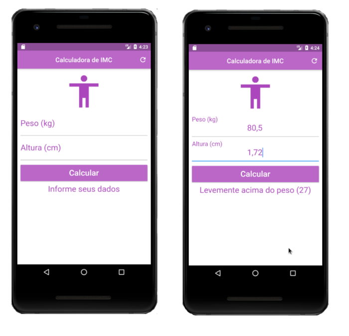

# Calculadora de IMC

Aplicativo para calcular IMC, consiste em dois campos de entradas do tipo number(double), um botão para ação de calcular, um texto para informar o status dos cálculos e um botão para refresh para limpar a pagina.

### Widgets exercitados
- Scaffold
- AppBar
- SingleChildScrollView
- RaisedButton
- Forms
- GlobalKey
- TextField
- TextFormField

## Getting Started

This project is a starting point for a Flutter application.

A few resources to get you started if this is your first Flutter project:

- [Lab: Write your first Flutter app](https://flutter.dev/docs/get-started/codelab)
- [Cookbook: Useful Flutter samples](https://flutter.dev/docs/cookbook)

For help getting started with Flutter, view our
[online documentation](https://flutter.dev/docs), which offers tutorials,
samples, guidance on mobile development, and a full API reference.
