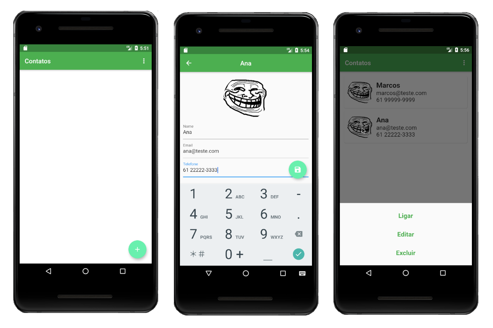
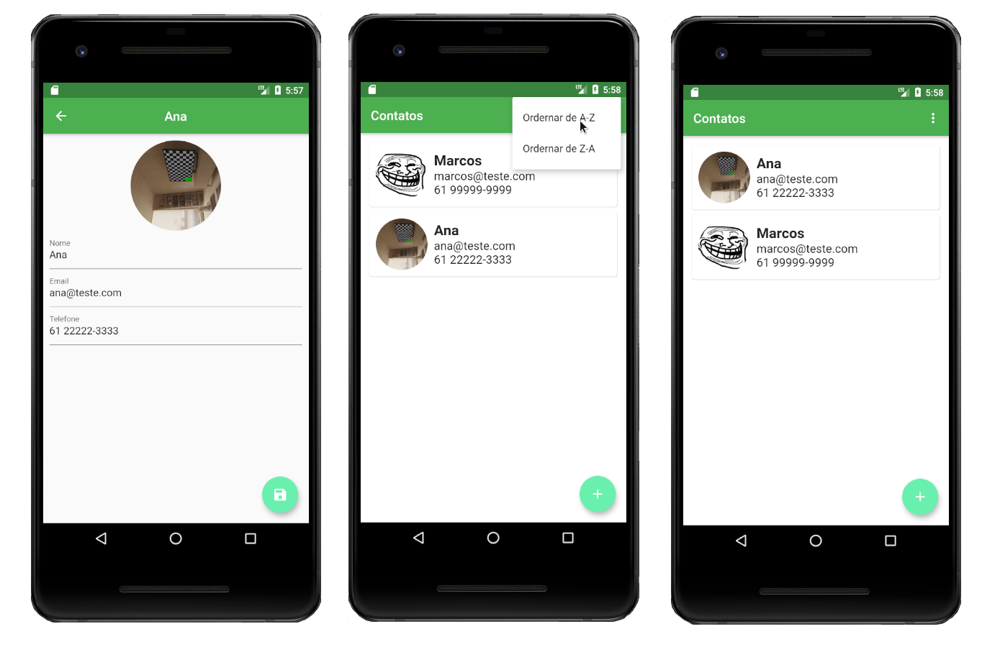

### Contatos

 O aplicativo consiste em uma lista de contatos. A tela inicial possui um botão flutuante localizado no canto inferior direito. Ao clicar nesse botão, uma nova tela é aberta com três campos de entrada: Nome, Email e Telefone. Também é carregado um campo para inserir uma imagem padrão. Esta imagem poderá ser alterada usando a própria câmera do dispositivo. Após preencher as informações, o usuário poderá clicar no botão flutuante para salvar os dados. A tela inicial será atualizada com o novo contato adicionado.

 O app também conta com um menu inferior com opções para ligar, editar e excluir um contato. Ao clicar em "Ligar", o usuário será redirecionado automaticamente para o app telefone do dispositivo. Se selecionada a opção "Editar", o app retornará a tela de inclusão de dados para que o usuário possa alterar os dados que deseja. Se escolhida a opção "Excluir", um popup para confirmação de exclusão será exibido e o usuário poderá excluir ou cancelar a exclusão. Além disso, existe um menu no canto superior direito para ordenar a lista de A – Z e de Z – A.

 Todas essas informações são armazenada em um banco de dados SQFlite.

### Widgets e conceitos exercitados
- Banco SQFlite
- Singleton
- Card
- CircleImage
- WillPopScope
- BottomSheet
- AlertDialog
- PopupMenuButton
- ImagePicker
- Url Launcher
- Focus

### Getting Started

This project is a starting point for a Flutter application.

A few resources to get you started if this is your first Flutter project:

- [Lab: Write your first Flutter app](https://flutter.dev/docs/get-started/codelab)
- [Cookbook: Useful Flutter samples](https://flutter.dev/docs/cookbook)

For help getting started with Flutter, view our
[online documentation](https://flutter.dev/docs), which offers tutorials,
samples, guidance on mobile development, and a full API reference.
