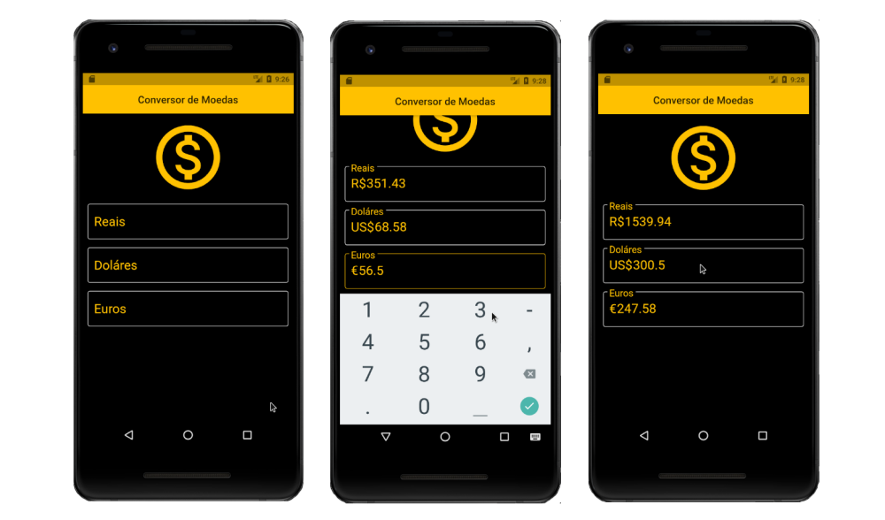

### Conversor de Moedas

Aplicativo para calcular valores monetários em real, dólar e euro, consiste em três campos de entradas para cada moeda, sendo que em qualquer campo que informar um valor os cálculos são realizados automaticamente nos demais campos. Os valores base para realização dos cálculos são recuperado através da API publica (api.hgbrasil).

### Conceitos flutter/dart exercitados
- Json
- API
- Future
- FutureBuilder

## Getting Started

This project is a starting point for a Flutter application.

A few resources to get you started if this is your first Flutter project:

- [Lab: Write your first Flutter app](https://flutter.dev/docs/get-started/codelab)
- [Cookbook: Useful Flutter samples](https://flutter.dev/docs/cookbook)

For help getting started with Flutter, view our
[online documentation](https://flutter.dev/docs), which offers tutorials,
samples, guidance on mobile development, and a full API reference.
