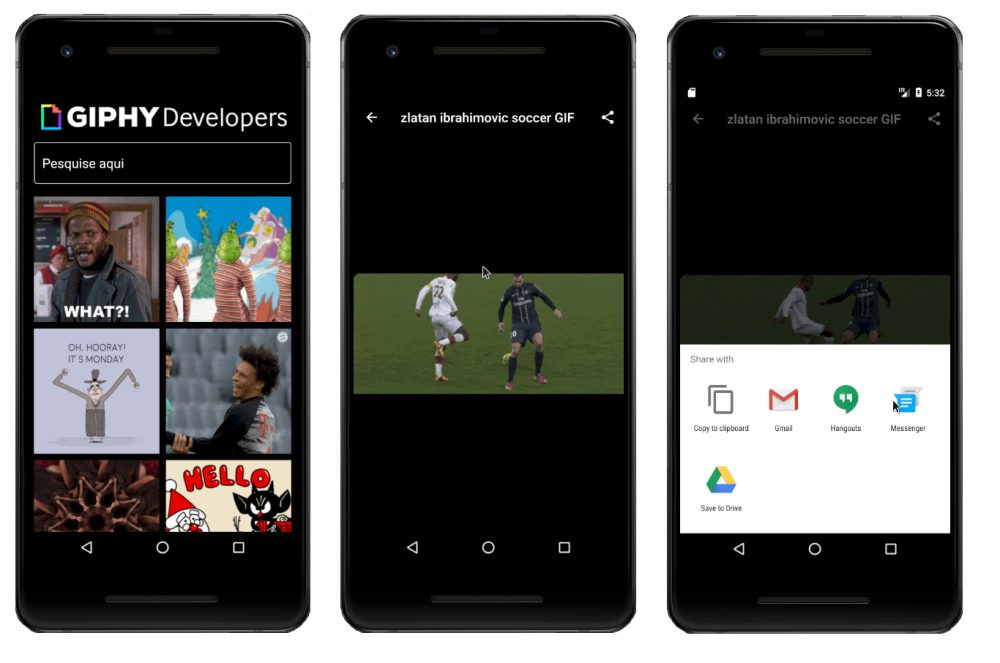

### Buscador de gifs

 Ao iniciar o aplicativo, um grid é carregado com os vinte gifs mais acessados da API (api.giphy). O app possui um campo de texto e um botão para realização de uma busca específica. Ele também possui capacidade de compartilhar um gif entre outros aplicativos instalados no dispositivo. Exemplo: Whatsaap, Gmail, Driver, Facebook entre outros. Para compartilhar, basta segurar o gif selecionado ou carregar o gif em uma segunda tela apenas clicando no gif escolhido, em seguida clicar no botão de compartilhamento.

### Widgets exercitados
- Navigator
- GridView
- Image Network
- GestureDetector
- ProgressIndicator
- Share
- FadeInImage
- Plugins

### Getting Started

This project is a starting point for a Flutter application.

A few resources to get you started if this is your first Flutter project:

- [Lab: Write your first Flutter app](https://flutter.dev/docs/get-started/codelab)
- [Cookbook: Useful Flutter samples](https://flutter.dev/docs/cookbook)

For help getting started with Flutter, view our
[online documentation](https://flutter.dev/docs), which offers tutorials,
samples, guidance on mobile development, and a full API reference.
