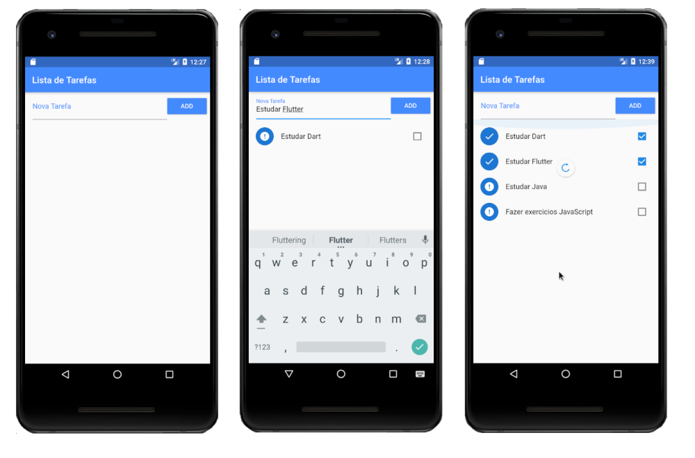
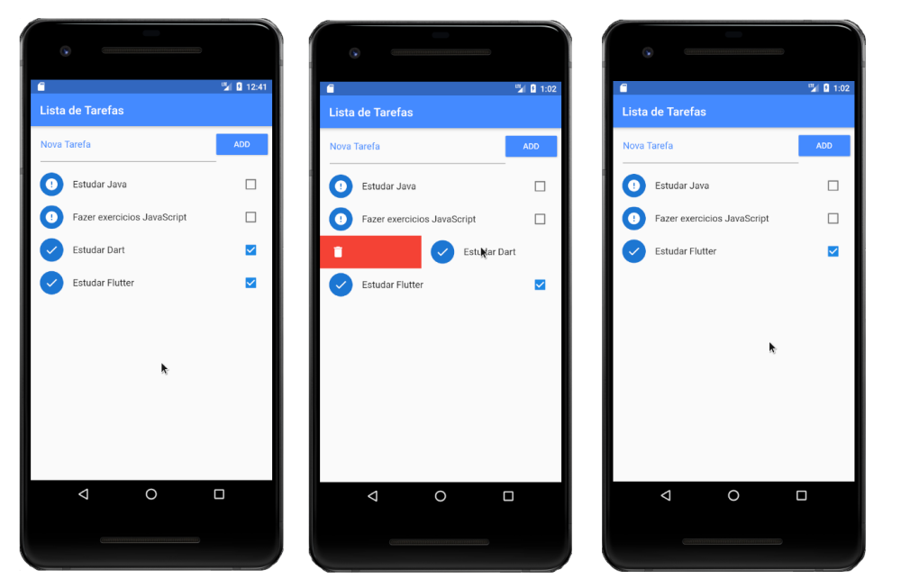

### Lista de Tarefas

Aplicativo consiste um campo para adicionar tarefas e botão para ação de adição formando uma lista de tarefas. Cada item da lista possui um checkbox para informar se a tarefa foi concluída e um ícone para informar o status de concluído. Essa lista fica armazenado em arquivo Json no dispositivo, então se fechar o aplicativo as informações serão preservadas. Para apagar uma tarefa, basta arrastar o item da esquerda para a direita. Alem disso o app ainda tem uma funcionalidade para ordenar os itens checados e não checados para isso é só arrastar de cima para baixo.

### Widgets e conceitos exercitados
- ListView
- SnackBar
- Dismissible
- ListTile
- CircleAvatar
- CheckBoxListTile
- RefreshIndicator
- Sort
- Armazenamento JSON

## Getting Started

This project is a starting point for a Flutter application.

A few resources to get you started if this is your first Flutter project:

- [Lab: Write your first Flutter app](https://flutter.dev/docs/get-started/codelab)
- [Cookbook: Useful Flutter samples](https://flutter.dev/docs/cookbook)

For help getting started with Flutter, view our
[online documentation](https://flutter.dev/docs), which offers tutorials,
samples, guidance on mobile development, and a full API reference.
